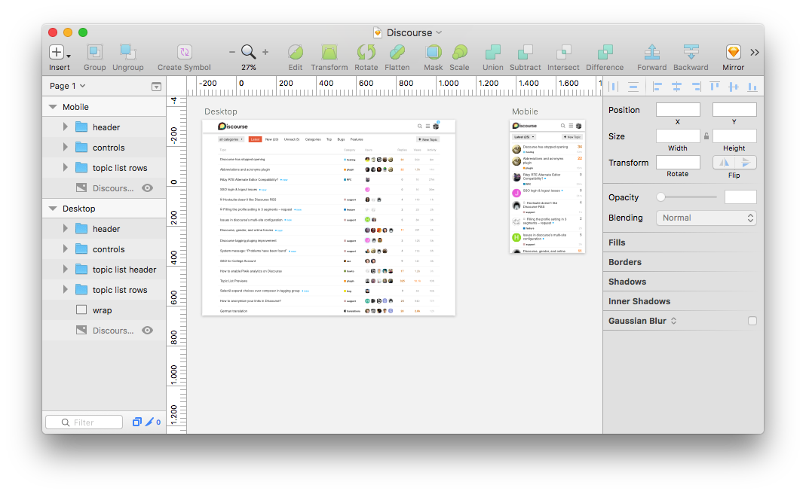

# Discourse theme in Sketch

This is a UI design of the default [Discourse](http://www.discourse.org/) theme
for [Sketch](https://www.sketchapp.com/). Feel free to use this file
as a template to try out ideas for your own theme customisations.

If you don't have a Mac and/or Sketch, [Figma](https://www.figma.com/)
is an online UI design application that can import Sketch files.

Happy designing!
